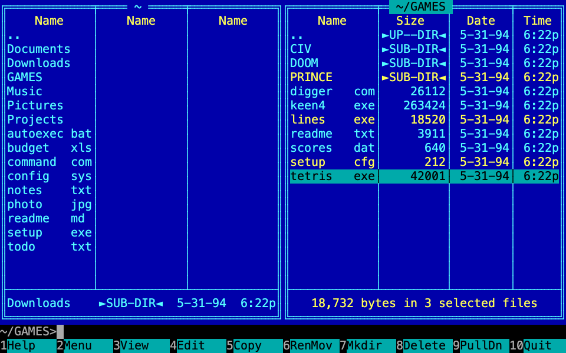
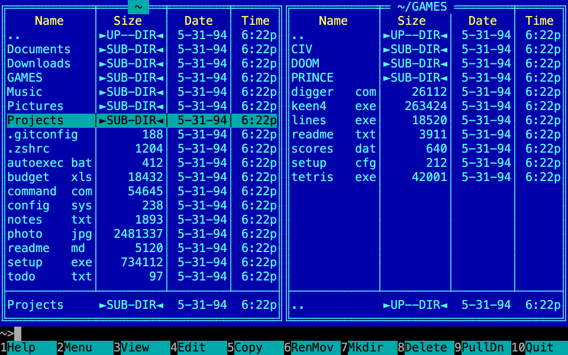

# Terminal Commander

A two-panel file manager for the macOS terminal that looks like Norton Commander 4/5 from the DOS days, and is meant to be good enough for daily use.



The look follows the original closely: blue panels with double cyan frames, brief mode in three columns with DOS-style `name  ext` alignment, `►SUB-DIR◄` markers, a mini status line, a black command line and the `1Help 2Menu … 10Quit` key bar. Under the hood it's Go and [tcell](https://github.com/gdamore/tcell) with its own thin drawing layer. There's no TUI framework.

> [!NOTE]
> **Work in progress.** Stages 1–5 of 6 are done: the panels, dialogs, the F9 menu, drive selection, help, file operations (copy, move, make directory, delete to the Trash or permanently) and the command line. The viewer and the editor aren't built yet. See [Roadmap](#roadmap).

## Contents

- [Features](#features)
- [Requirements](#requirements)
- [Installation](#installation)
- [Getting started](#getting-started)
- [Keys](#keys)
- [Terminal setup](#terminal-setup)
- [Development](#development)
- [Project layout](#project-layout)
- [Roadmap](#roadmap)

## Features

What works now:

- Two file panels, each with its own directory; **Tab** switches between them and **Control-U** swaps them.
- **Brief mode:** three `Name` columns. Names with a 1–3 character extension are aligned like in DOS. A name that doesn't fit ends with `}`.
- **Full mode:** `Name │ Size │ Date │ Time` with NC-style dates (`5-31-94`) and times (`6:22p`).
- Sorting puts `..` first, then directories, then files, all case-insensitive.
- Selection with **Insert** or **Space**. The mini status shows `N bytes in M selected files`.
- Hidden files (dotfiles) can be shown or hidden in both panels at once.
- Symlinks show as the file or directory they point to. Broken links show as files.
- The **Esc prefix** stands in for Option/Alt in any terminal, and **Esc 1…0** gives F1…F10.
- A **command line** under the panels: type a command and press **Enter** to run it with your `$SHELL` in the active panel's directory. `cd` changes the panel's directory. **Control-E / Control-X** walk the history, **Control-Enter** (or **Control-J**, or **Esc Enter**) puts the file name under the cursor into the line, and **Control-O** shows the terminal with the output of earlier commands.
- **Enter** on a program runs it; on any other file it opens the file with its app, as `open` does.
- NC's EGA palette in true color, with a fallback to the nearest 256 colors.
- A `--keytest` mode that shows which keys your terminal actually sends.
- A crash leaves the terminal usable and saves the stack trace to `~/.config/terminal-commander/crash.log`.



## Requirements

- macOS. Development and testing happen on Apple Silicon.
- [Go](https://go.dev/dl/) 1.27 or newer, to build from source.
- A terminal window of at least 80×24.
- A font with box-drawing characters. Menlo, SF Mono, JetBrains Mono and most monospace fonts have them.

## Installation

The repository is private for now, so you need access to `navoznov/terminal-commander` on GitHub.

### From source with `make`

```sh
git clone https://github.com/navoznov/terminal-commander.git
cd terminal-commander
make install        # builds ./tc and copies it to ~/bin/tc
```

Make sure `~/bin` is in your `PATH`. For zsh, add this to `~/.zshrc`:

```sh
export PATH="$HOME/bin:$PATH"
```

### With `go install`

```sh
export GOPRIVATE=github.com/navoznov/*   # the repo is private
go install github.com/navoznov/terminal-commander/cmd/tc@latest
```

The binary goes to `$(go env GOPATH)/bin`, which is usually `~/go/bin`.

### Build only

```sh
make build          # or: go build -o tc ./cmd/tc
./tc
```

### Uninstall

```sh
rm ~/bin/tc
rm -rf ~/.config/terminal-commander   # only if you want to remove the crash log too
```

## Getting started

```sh
tc                  # both panels open in the current directory
tc ~/Projects       # both panels open in the given directory
tc --keytest        # key diagnostics instead of the file manager
```

A first session:

1. Move with **↑ ↓**, and with **← →** between columns in brief mode.
2. Press **Enter** on a directory to go into it. **Backspace**, or **Enter** on `..`, goes up a level.
3. Press **Tab** to switch to the other panel, and **Control-T** to switch the current panel between brief and full mode.
4. Select files with **Insert** or **Space**. The bottom line of the panel shows their total size.
5. Press **Esc** then **.** to show or hide dotfiles.
6. Type a command, for example `ls -l`, and press **Enter**. Press any key to come back to the panels; **Control-O** shows that output again.
7. Press **F10**, or **Esc** then **0**, to quit.

## Keys

| Key | Action |
|---|---|
| ↑ ↓ | Move the cursor |
| ← → | Previous or next column in brief mode, page up or down in full mode |
| Home / End (Fn-← / Fn-→) | First or last entry |
| PgUp / PgDn (Fn-↑ / Fn-↓) | Page up or down |
| Enter | Run the command line if it isn't empty; otherwise go into the directory, run the program or open the file |
| Backspace, Control-PgUp | Go up a level |
| Tab | Switch the active panel |
| Insert, Space | Select or unselect the entry and move down |
| Control-T | Switch between brief and full mode |
| Control-1 / Control-2 | Brief / full mode (most terminals don't send these) |
| Control-R | Re-read the active panel |
| Control-U | Swap the panels |
| Alt-. or Esc then . | Show or hide hidden files |
| + / - / * | Select or unselect by mask, invert selection |
| Alt-F1 / Alt-F2 (Esc F1 / Esc F2) | Choose the left / right drive |
| Control-Enter, Control-J, Esc Enter | Put the name under the cursor into the command line |
| Control-E / Control-X | Previous / next command from the history |
| Control-O | Hide the panels and show the terminal until a key is pressed |
| Esc | Clear the command line |
| F1 | Help |
| F2, F9 | Menu |
| F5 | Copy the selected files, or the file under the cursor, to the other panel |
| F6 | Rename or move |
| F7 | Make a directory |
| F8 | Move to the Trash |
| Shift-F8 | Delete permanently |
| Esc then 1…0 | F1…F10 |
| F10 | Quit |

### The Esc prefix

On macOS, Option often doesn't reach terminal programs as Alt. As in NC and Midnight Commander, you can press **Esc** and then another key within one second, and the app treats it as that key with Alt. For example, `Esc .` is Alt-., `Esc 5` is F5 and `Esc F1` is Alt-F1. On the Russian keyboard layout `Esc ю` works as well, because `ю` is on the `.` key.

## Terminal setup

To make Option work as Alt directly:

| Terminal | Setting |
|---|---|
| iTerm2 | Settings → Profiles → Keys → Left Option key → `Esc+` |
| Terminal.app | Settings → Profiles → Keyboard → “Use Option as Meta key” |
| VS Code | `"terminal.integrated.macOptionIsMeta": true` |

F-keys should work as F-keys, without holding Fn. Set this in System Settings → Keyboard → “Use F1, F2, etc. keys as standard function keys”. Otherwise press Fn with them, or use the Esc prefix.

Run `tc --keytest` to see what your terminal sends (Control-C to exit). Results for specific terminals are in [docs/terminal-compat.md](docs/terminal-compat.md).

## Development

```sh
make test           # go test ./...
go test ./internal/app ./internal/panel -update   # rewrite golden screens after an intended UI change
```

Screen rendering is covered by golden tests. They draw the screen on `tcell.SimulationScreen` at 80×25 and compare it to `testdata/*.golden`, which stores both the characters and the color roles of every cell.

Design docs:

- Spec: [docs/superpowers/specs/2026-09-28-terminal-commander-design.md](docs/superpowers/specs/2026-09-28-terminal-commander-design.md)
- Implementation plans: [docs/superpowers/plans/](docs/superpowers/plans/)

The `main` branch changes only through pull requests. Each stage gets its own `feature/...` branch.

## Project layout

```
cmd/tc/            entry point: screen setup, --keytest, crash handling
internal/term/     EGA palette, canvas and drawing primitives (text, frames)
internal/keys/     key normalizer (Esc prefix, Alt+digit → F-key)
internal/fs/       directory listing, NC-style size/date/time formatting
internal/panel/    file panel: cursor, scrolling, selection, modes, rendering
internal/shell/    command line: history, built-in cd, running commands
internal/app/      two panels, command line, key bar, key handling
internal/keytest/  the --keytest diagnostics screen
```

`fs` doesn't know about the screen, `panel` doesn't know about the other panel, and only `app` connects everything.

## Roadmap

| Stage | Contents | Status |
|---|---|---|
| 1 | Drawing layer, NC colors, key bar, Esc prefix, `--keytest` | ✅ |
| 2 | File panels: navigation, modes, mini status, hidden files, sorting | ✅ |
| 3 | Dialogs, F9 menu, drive selection (`/`, `~`, `/Volumes/*`), F1 help | ✅ |
| 4 | F5 copy, F6 move, F7 mkdir, F8 delete to Trash, Shift-F8 delete permanently, with progress | ✅ |
| 5 | Command line, Control-O, command history | ✅ |
| 6 | F3 viewer (text/hex/search), F4 editor via `$EDITOR`, mouse, config file | ⏳ |

Out of scope for v1: a built-in editor, the F2 user menu, file search, directory comparison, archives and network panels.
